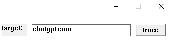
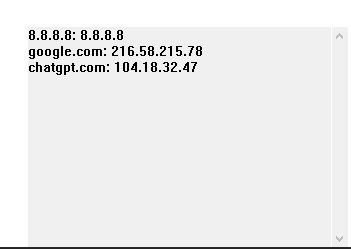
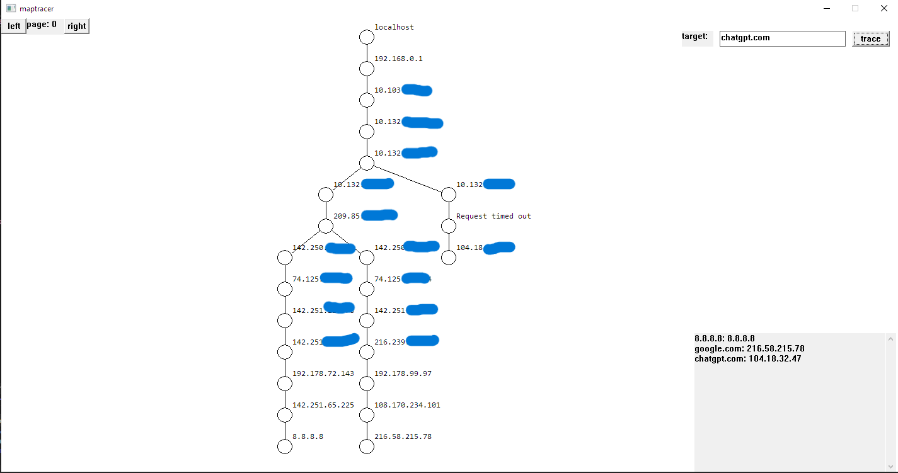
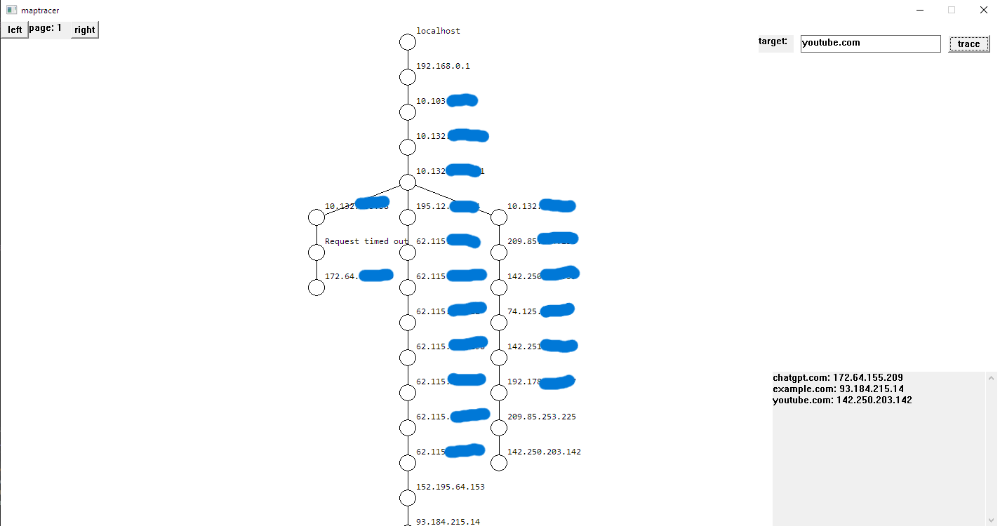

# MapTracer

MapTracer - это курсовой проект, который являет собой инструмент для визуализации сетевых маршрутов. 

## Функциональные возможности

- Трассировка сетевых маршрутов
- Трассировка по IP или доменному имени
- Визуализация сетевой топологии
- Одновременная поддержка до 20 независимых страниц

## Технологии

- Win32API
- Winsocks2
- ICMP

## Как пользоваться
### Трассировка
Чтоб начать трассировку, надо ввести IP-адрес или доменное имя интересующего нас узла в поле, которое находится в верхнем правом углу.

После ввода нужно нажать кнопку `trace`. После нажатия создастся отдельный поток, который будет заниматься поиском пути. Если ошибок не будет, то найденный путь добавится в историю запросов.

### Страницы
Для переключения между страницами в левом верхнем углу есть кнопки `left` и `right`. В приложении может быть до 20 страниц (Для изменения этого количества нужно отредактировать макрос `PAGES`)

### Управление
Управлять полем с графом можно с помощью стрелок `left`, `right`, `up` и `down`. Для того, чтоб войти в режим управления полем нужно нажать `RMB`.
### Общий вид
Вот так выглядят 2 разных страницы. они имеют свои графы путей и свою историю трассировки.

## Баги
В коде могут присутствовать баги, я буду работать над их устранением. 

